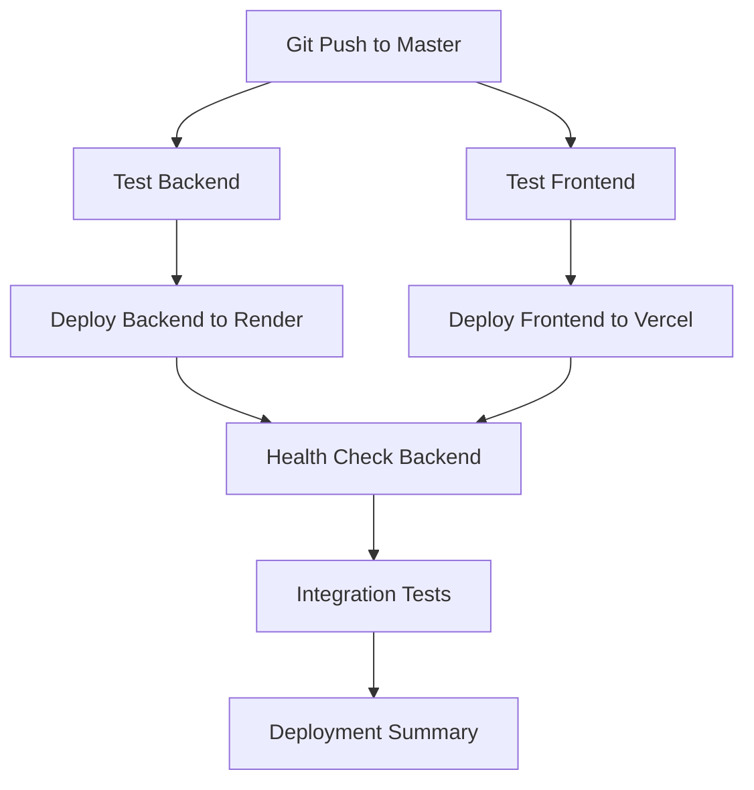

# 🚀 MindCare CI/CD Pipeline Configuration

## 📁 Workflow Files Created

### 1. Test Pipeline
- **File**: `.github/workflows/test-pipeline.yml`
- **Purpose**: Test builds without deployment
- **Triggers**: All pushes and PRs
- **Usage**: For testing changes safely

### 2. Deployment Pipeline  
- **File**: `.github/workflows/deploy.yml`
- **Purpose**: Full CI/CD with deployment
- **Triggers**: Pushes to `master` branch only
- **Features**:
  - ✅ Backend testing and building
  - ✅ Frontend testing and building
  - ✅ Automated deployment to Render
  - ✅ Automated deployment to Vercel
  - ✅ Health checks and integration tests
  - ✅ Deployment notifications

## 🎯 Pipeline Flow



## 🔧 Environment Configuration

### Backend Environment Variables (Render)
```yaml
SPRING_PROFILES_ACTIVE: production
SPRING_DATASOURCE_URL: [From Render Database]
SPRING_DATASOURCE_USERNAME: [From Render Database]
SPRING_DATASOURCE_PASSWORD: [From Render Database]
JWT_SECRET_KEY: [Auto-generated]
JWT_EXPIRATION: 86400000
ADMIN_EMAIL: admin@mindcareconnect.bd
ADMIN_PASSWORD: MindCare@AdminProd2025!
CORS_ALLOWED_ORIGINS: "http://localhost:3000,https://mind-care-zeta.vercel.app"
```

### Frontend Environment Variables (Vercel)
```yaml
NEXT_PUBLIC_API_URL: https://mindcare-backend-uyos.onrender.com/api
NEXT_PUBLIC_ENVIRONMENT: production
```

## 📋 Next Steps

1. **Configure GitHub Secrets** (see SECRETS_SETUP.md)
2. **Test the pipeline** by pushing a small change
3. **Monitor deployment** in GitHub Actions tab
4. **Verify both applications** are working

## 🔍 Monitoring

### GitHub Actions
- View all workflows: `https://github.com/RaiZen094/MindCare/actions`
- Check specific run: Click on workflow run for details

### Deployment URLs
- **Frontend**: https://mind-care-zeta.vercel.app
- **Backend**: https://mindcare-backend-uyos.onrender.com
- **Health Check**: https://mindcare-backend-uyos.onrender.com/api/auth/health

### Logs and Debugging
- **Render Logs**: Dashboard → Service → Logs tab
- **Vercel Logs**: Dashboard → Project → Functions tab
- **GitHub Actions**: Repository → Actions tab

## 🚨 Pipeline Triggers

### Automatic Deployment
- ✅ Push to `master` branch
- ✅ Direct commits to `master`
- ✅ Merged pull requests to `master`

### Test Only (No Deployment)
- ✅ Push to feature branches
- ✅ Pull requests
- ✅ Manual workflow triggers

## 📈 Pipeline Benefits

- 🚀 **Automated Deployment**: No manual steps required
- 🧪 **Automated Testing**: Catch issues before deployment
- 🔄 **Rollback Capability**: Easy to revert problematic changes
- 📊 **Deployment History**: Track all deployments in GitHub
- 🔔 **Notifications**: Know immediately if deployment fails
- 🛡️ **Quality Gates**: Tests must pass before deployment
